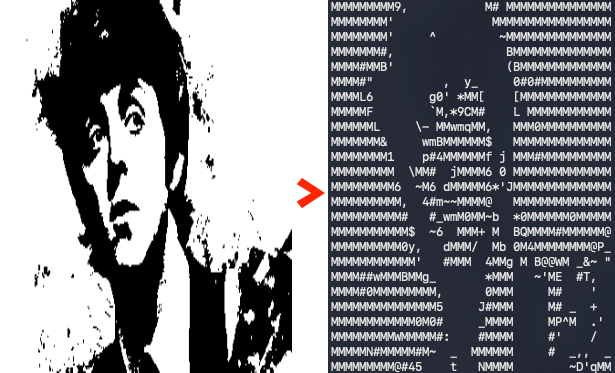

# img2char

[](https://opensource.org/licenses/MIT)
[](https://goreportcard.com/report/github.com/yostos/img2char)
[](https://go.dev/)



A CLI tool that converts monochrome binary images to ASCII art.

Instead of mapping pixel density to characters (the conventional approach), img2char matches 8x8 dot shape patterns using Hamming distance to find the most visually similar character. This produces ASCII art that reflects not only brightness but also line direction and contour shapes.

## Background

Around 1986, on a Sharp X1 computer, I wrote a BASIC program that read 8x8 dot blocks from the graphic VRAM and matched them against character patterns in the character ROM to automatically convert images into ASCII art. This was motivated by posting to BBS forums on Japanese personal computer networks.

This project recreates that idea on a modern platform.

## How It Works

Three-stage pipeline:

1. **Font pattern generation** — 8x8 bitmaps for 95 printable ASCII characters (0x20–0x7E) from [font8x8](https://github.com/dhepper/font8x8) (Public Domain)
2. **Image loading & blocking** — Read PNG → validate resolution (640x200 or 320x200) → split into 8x8 blocks
3. **Matching** — XOR each block with 95 font patterns → popcount (Hamming distance) → select closest character

## Installation

### Homebrew

```bash
brew install yostos/tap/img2char
```

### go install

```bash
go install github.com/yostos/img2char@latest
```

### Build from source

```bash
go build -o img2char
```

No external dependencies. Go standard library only.

## Usage

```bash
./img2char [-v] [-version] <image-file>
```

### Options

| Option     | Description                     | Default |
| ---------- | ------------------------------- | ------- |
| `-v`       | Print processing info to stderr | off     |
| `-version` | Print version and exit          |         |

### Input

- Format: PNG only
- Content: Pre-binarized monochrome image
- Resolution: 640x200 (→ 80x25 chars) or 320x200 (→ 40x25 chars)

## Testing

```bash
go test -v ./...    # Run all tests (27 tests)
go vet ./...        # Static analysis
```

## Sample Script

`convert.sh` is a sample wrapper script that uses ImageMagick to resize and binarize any image before passing it to img2char.

```bash
./convert.sh <input-image>              # 640x200 (default)
./convert.sh -w 320 <input-image>       # 320x200
./convert.sh -n <input-image>           # negate (dark areas as subject)
./convert.sh -t 40 -n <input-image>     # adjust threshold + negate
```

Requires [ImageMagick](https://imagemagick.org/) (`magick` command).

## License

MIT
